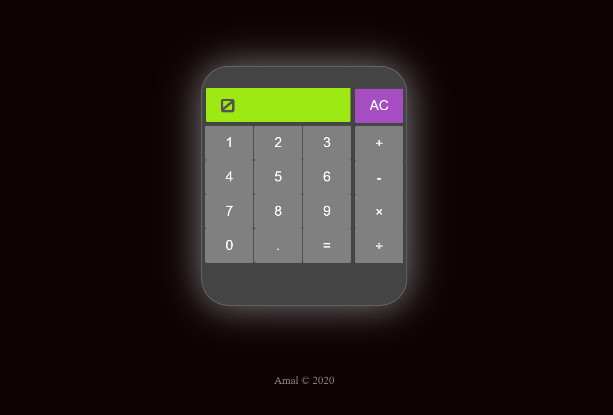

# Calculator
    

I created this simple and basic calculator as a part of The Odin Project web development course.

### Technologies:
- HTML
- CSS
- JavaScript
- VSCode

https://www.theodinproject.com/

